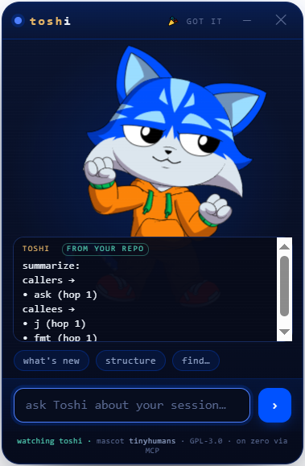

# Toshi — a terminal companion

[](https://github.com/philpof102-svg/toshi/actions/workflows/ci.yml)



A tiny AI companion that lives **beside your terminal**, wearing the community-ready **Toshi** mascot from
[tinyhumansai/mascots](https://github.com/tinyhumansai/mascots). It watches your [`gitlawb/zero`](https://github.com/gitlawb/zero)
coding session and you can **talk to it about what's happening** — what changed, why a test is red, what to do next —
through a small, token-cheap context instead of a full chat UI.

> Not a new mascot. We take the **already-open-source Toshi model** ([PR #2, merged](https://github.com/tinyhumansai/mascots/pull/2))
> and give it **tools**: a `zero` plugin + an MCP server + a side-panel that renders the real Rive mascot.

## What it is

- **Rides on `gitlawb/zero`** — Zero is the runtime (Go, MIT, MCP client **and** server). Toshi is a **plugin**
  (`./.zero/plugins/toshi/`) plus a **stdio MCP server** so any MCP client (Claude Desktop, Cline, …) can call it.
- **The mascot on the side** — `panel/index.html` is a WebView that loads the real `toshi.riv` from the tinyhumans
  manifest and drives its state machine (idle · look_around · pointing · hand_wave · dancing · celebration, plus the
  eye channel). It's the face; the MCP is the brain.
- **Token-cheap by design** — session awareness comes from [`DeusData/codebase-memory-mcp`](https://github.com/DeusData/codebase-memory-mcp)
  (MIT): a persistent knowledge graph of the repo, ~99% fewer tokens than reading files one by one. Toshi asks *it*
  what changed instead of re-reading the tree, so most turns stay small.
- **You sign, always** — any money action is descriptor-only: Toshi *prepares* a transaction, you sign it. No custody.

## Layout

```
toshi/
├── panel/index.html      the side-panel WebView (renders the real Toshi mascot + talk-to-session)
├── mcp/toshi-mcp.mjs      the MCP server (toshi_status / toshi_ask / toshi_mood) + the /ask bridge the panel calls
├── plugin/plugin.json     the gitlawb/zero plugin manifest
├── tinyhumans/mascots.json pinned copy of the upstream manifest (the mascot contract we consume)
├── ATTRIBUTION.md         upstream credits + licences
└── LICENSE                GPL-3.0 (the Toshi mascot is GPL-3.0, so this is too)
```

## Run it

**The floating companion (Clippy-energy)** — one command launches the mascot window *and* its brain:

```bash
npm install          # once
npm run toshi        # a frameless, always-on-top Toshi floats bottom-right, over any terminal
```

**Launch from anywhere** (Windows · macOS · Linux) — `npm i -g .` once, then just type `toshi` in any repo and
it floats over that terminal, reading that repo. Windows also has a double-clickable **`toshi.bat`**. Drag Toshi
by its header; hide it with ✕. It greets you with a wave, floats + blinks on its own, reacts when you ask, and
bursts into a celebration when it has a *grounded* answer from your repo.

**Make its answers real** — index your repo so `toshi_ask` reads the graph instead of guessing (token-cheap):

```bash
# get codebase-memory-mcp (MIT, local, no telemetry), then:
codebase-memory-mcp cli index_repository '{"repo_path":"/abs/path/to/your/repo"}'
# tell Toshi where the repo + binary are (optional; defaults to cwd / PATH):
export TOSHI_REPO=/abs/path/to/your/repo
export CODEBASE_MEMORY_BIN=/abs/path/to/codebase-memory-mcp
```

Until then Toshi runs in **honest demo mode** — the mascot is fully alive, and it *says* it can't read your
session yet (with the exact index command) rather than inventing an answer.

**Give Toshi a voice (optional)** — install [`zero`](https://github.com/gitlawb/zero) and run `zero setup` with any
provider (free/local models like ollama work). Toshi then *speaks* its grounded answers in your language —
1-3 warm sentences synthesized ONLY from what it retrieved, never invented. `TOSHI_LLM=off` disables it.

## Put the CLI everywhere

The same three files run on **Windows, macOS and Linux** (CI-proven on all three):

| Surface | How |
|---|---|
| **Any terminal (everyone)** | `npm i -g github:philpof102-svg/toshi` — no registry needed. Then type `toshi` in any repo: first call floats the companion; typing `toshi` in *another* terminal connects that repo to it (no second window). Electron is **optional** — where it can't install, `toshi` runs the brain + a browser panel at `http://127.0.0.1:4821/panel/` instead. |
| **[zero](https://github.com/gitlawb/zero) plugin** | drop this repo at `./.zero/plugins/toshi/` → zero gets `toshi_status` / `toshi_ask` / `toshi_mood` / `toshi_watch`. |
| **Auto-float with zero** | `toshi setup` (or `npm run zero-hook`) once → a `sessionStart` hook makes Toshi appear (watching that repo) every time you launch zero. `toshi setup --remove` undoes it. |
| **Summon / minimize** | `toshi show` · `toshi hide` · `toshi toggle` from any terminal (picked up in ~4s). The ─ button folds Toshi into a small floating head — click it to expand; ✕ quits. |
| **Claude Desktop / Cline / any MCP client** | register the stdio server: `{"command": "node", "args": ["/abs/path/toshi/mcp/toshi-mcp.mjs"]}` |
| **Scripts / anything HTTP** | `POST http://127.0.0.1:4820/ask {"q":"…"}` · `POST /repo {"path":"…"}` · `GET /health` |
| **Browser (no Electron)** | `node serve.js` → `http://127.0.0.1:4821/panel/` |

## Honest status

- **v0, unaudited.** The panel + mascot rendering are real; the MCP's "answer about your session" is a skeleton that
  bridges to `codebase-memory-mcp` — wire your model/provider before trusting its answers.
- The Rive runtime and the `.riv` load over the network in a real browser/WebView. Vendor them for offline use.
- Licence: **GPL-3.0** (the upstream Toshi mascot is GPL-3.0; a derivative must match it). See `ATTRIBUTION.md`.

## Credits

Mascot **Toshi** by [tinyhumans](https://github.com/tinyhumansai/mascots) (GPL-3.0). Session memory by
[codebase-memory-mcp](https://github.com/DeusData/codebase-memory-mcp) (MIT). Runtime [gitlawb/zero](https://github.com/gitlawb/zero) (MIT).
