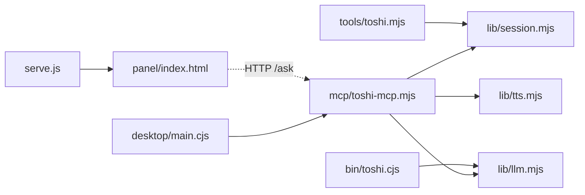

# Dependency spine

```mermaid
graph LR
  brain[mcp/toshi-mcp.mjs] --> session[lib/session.mjs]
  brain --> llm[lib/llm.mjs]
  brain --> tts[lib/tts.mjs]
  plugin[tools/toshi.mjs] --> session
  desktop[desktop/main.cjs] --> brain
  panel[panel/index.html] -.HTTP /ask.-> brain
  serve[serve.js] --> panel
  cli[bin/toshi.cjs] --> llm
```

## Top imported local modules (from .graph/)

| Local module | Importers |
|---|---|
| llm.mjs | 8 |
| session.mjs | 5 |
| tts.mjs | 2 |
